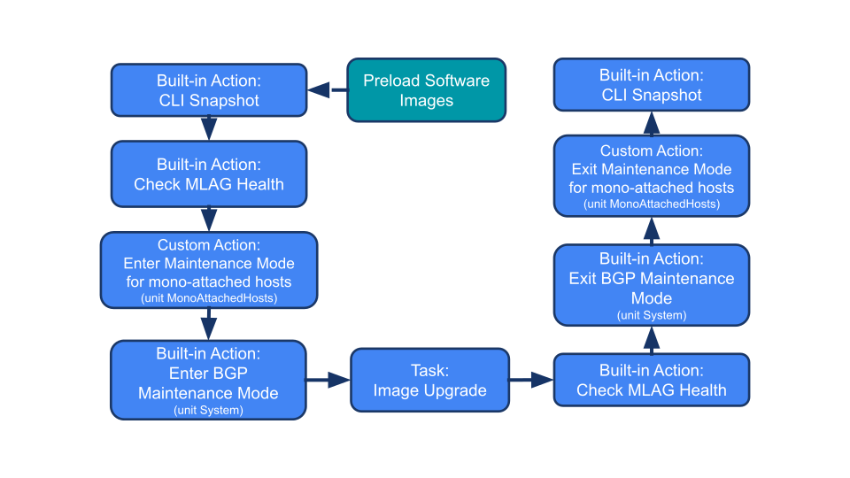

# Custom Maintenance Mode Actions for CloudVision

In order to orchestrate a custom Maintenance Mode unit in EOS (another unit than `System`), we need to create custom actions in CloudVision.

This repository provides 2 custom actions:
- [enter-mm.py](./enter-mm.py) which places into maintenance a custom unit
- [exit-mm.py](./exit-mm.py) which puts out of maintenance a custom unit

## How to add these actions in CloudVision ?

1) Go to `Provisioning -> Actions -> New Action`.
2) Give a name (e.g. `Enter Maintenance Mode`). Action Type is `Change Control`.
3) Copy and paste the script [enter-mm.py](./enter-mm.py). Go to `Manage Arguments` and create the built-in dynamic arguement `DeviceID` and another dynamic argument named `maintenanceUnit`. Both are required.
4) Save and repeat the operation for the `Exit Maintenance Mode` custom action.

## EOS Upgrade Workflow Automation for a leaf

Here is an example of automation workflow to upgrade an EOS leaf with mono attached hosts:

The custom actions in this workflow can be implemented using the script in this repository.